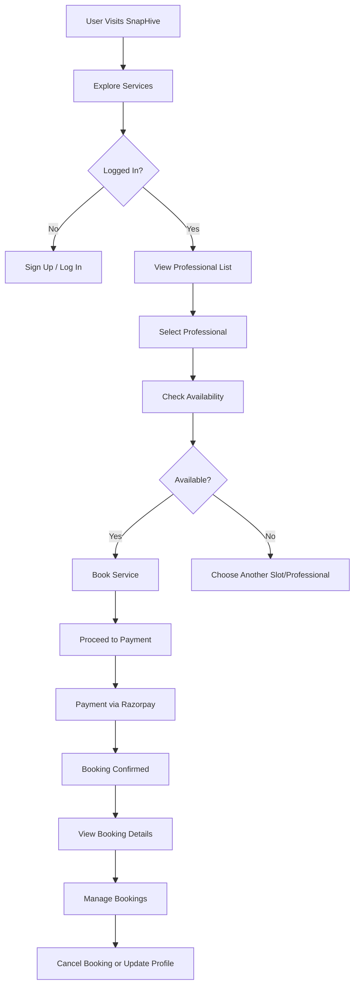
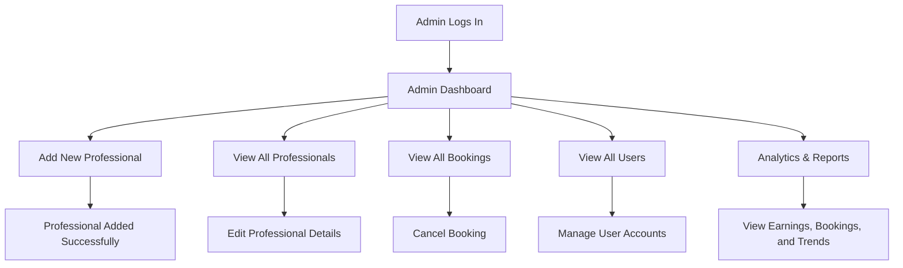
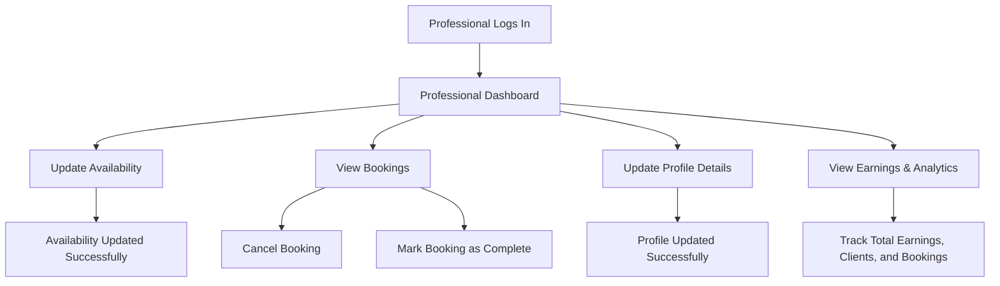
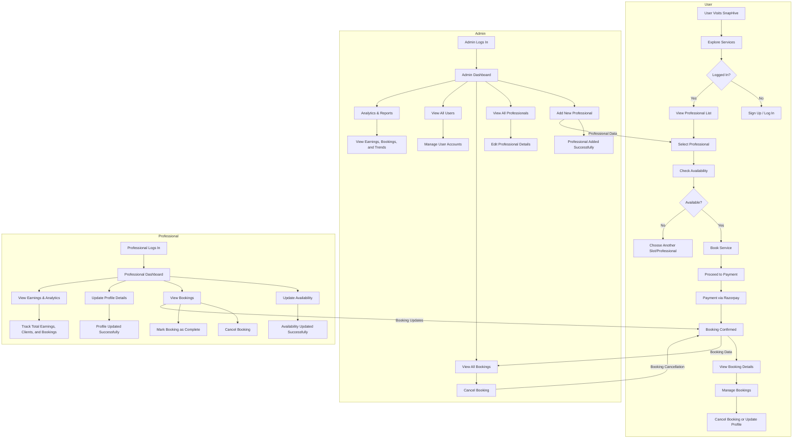

# **SnapHive Services – Redefining Professional Service Booking!**  
 *Your Gateway to Professional Services* 🚀  

SnapHive is a **modern, scalable, and user-friendly** platform that seamlessly connects users with **verified professionals** for hassle-free service booking. Whether you’re a **customer** seeking services, a **professional** managing bookings, or an **admin** overseeing operations, **SnapHive has got you covered!**

## **🌐 Live Demo**  
- **Frontend**: [SnapHive Live](https://snaphive-service.vercel.app/)  
- **Admin Panel**: [SnapHive Admin](https://snaphive-services.vercel.app/)  
- **GitHub Repository**: [SnapHive Services](https://github.com/deepakcode21/snaphive-services)

## **🖼️ UI Preview**

|  |  |  |
|---|---|---|
|  |  |  |
|  |  |  |
|  |  |  |
|  |  |  |


## **🎯 Project Overview**  
SnapHive is designed to **simplify** the process of booking professional services with an intuitive and efficient workflow. It operates with three distinct roles:

### **👤 Users**  
- Browse services **without an account**.  
- **Sign up / Log in** to book services.  
- Book professionals based on **availability, date, and time slots**.  
- Secure **online payments** via Razorpay.  
- Manage profiles, including **age, address, profile picture, and gender**.  

### **👨‍💼 Admins**  
- **Add professionals** to the platform.  
- Oversee **bookings, users, and professionals**.  
- Modify **professional availability** and cancel bookings.  
- View **real-time analytics** on bookings and earnings.  

### **👩‍🔧 Professionals**  
- Update **availability and profile details** (e.g., fees, address, service description).  
- View and manage **bookings**.  
- Track **total earnings, clients, and bookings**.  
- Cancel or **mark bookings as complete**.  

## **✨ Key Features**  

### **For Users**  
✅ Browse services without logging in.  
✅ Book services with **real-time availability checks**.  
✅ Secure **online payments** via Razorpay.  
✅ Manage bookings and update profiles.  

### **For Admins**  
✅ Add and manage professionals.  
✅ Oversee **all bookings and user activity**.  
✅ Modify **professional availability** and cancel bookings.  

### **For Professionals**  
✅ Update availability and service details.  
✅ View and manage bookings.  
✅ Track earnings and client history.  

## **🛠️ Technologies Used**  

### **Frontend**  
- **React.js** (Frontend framework)  
- **TailwindCSS** (Styling)  
- **Framer Motion** (Animations)  
- **React Router DOM** (Routing)  
- **Axios** (API Handling)  
- **React Toastify** (Notifications)  

### **Backend**  
- **Node.js** (Runtime environment)  
- **Express.js** (Backend framework)  
- **MongoDB** (Database)  
- **Mongoose** (ODM for MongoDB)  
- **JWT** (Authentication)  
- **Multer & Cloudinary** (File uploads)  
- **Razorpay** (Payment gateway)  


## **📥 Installation Guide**  

### **Frontend Setup**  
```bash
# Clone the repository  
git clone https://github.com/deepakcode21/snaphive-services.git
cd frontend  

# Install dependencies  
npm install  

# Set up environment variables (.env file)  
VITE_BACKEND_URL= ''
VITE_RAZORPAY_KEY_ID = ''

# Run the project  
npm run dev  
```
### **Admin Setup**  
```bash
cd admin  

# Install dependencies  
npm install  

# Set up environment variables (.env file)  
VITE_BACKEND_URL = ''
VITE_CURRENCY = ''

# Run the project  
npm run dev  
```

### **Backend Setup**  
```bash
cd backend  

# Install dependencies  
npm install  

# Set up environment variables (.env file)  
MONGODB_URI = ''
CLOUDINARY_NAME = ''
CLOUDINARY_API_KEY = ''
CLOUDINARY_SECRET_KEY = ''
ADMIN_EMAIL = ''
ADMIN_PASSWORD = ''
JWT_SECRET = ''
RAZORPAY_KEY_ID = ''
RAZORPAY_KEY_SECRET = ''
CURRENCY = ''

# Start the server  
node server.js  
```

---

## **🖥️ Usage**  

### **For Users**  
- Explore services and book professionals.  
- Manage bookings and update profiles.  

### **For Admins**  
- Add professionals and manage bookings.  
- View analytics and user activity.  

### **For Professionals**  
- Update availability and manage bookings.  
- Track earnings and client history.  

## **Detailed Flow Diagrams**  


### **1. User Flow**  


---

### **2. Admin Flow**  


---

### **3. Professional Flow**  


---

## **Global Flow Diagram**  
This diagram shows how **Users**, **Admins**, and **Professionals** interact within the SnapHive ecosystem.  



## **Explanation of the Global Flow**  

1. **User Interaction**:  
   - Users explore services, book professionals, and manage their bookings.  
   - Bookings are confirmed after payment via Razorpay.  

2. **Admin Interaction**:  
   - Admins add professionals, manage bookings, and oversee user activity.  
   - Admins can cancel bookings or modify professional availability.  

3. **Professional Interaction**:  
   - Professionals update their availability, manage bookings, and track earnings.  
   - They can mark bookings as complete or cancel them.  

4. **Interconnected Workflow**:  
   - **Bookings** are shared across all roles (User, Admin, Professional).  
   - **Professional availability** is managed by Admins and updated by Professionals.  
   - **Payment and booking confirmations** are reflected in real-time across the platform.  

This **detailed and global flow diagram** provides a comprehensive overview of how SnapHive operates. It’s clean, modern, and easy to understand, making it perfect for your `README.md` file. Let me know if you need further refinements! 🚀


## **🤝 Contributing**  
We welcome contributions! Follow these steps to contribute:  
1. **Fork** the repository.  
2. **Create a new branch** (`git checkout -b feature/YourFeatureName`).  
3. **Commit your changes** (`git commit -m 'Add some feature'`).  
4. **Push to the branch** (`git push origin feature/YourFeatureName`).  
5. **Open a pull request**.  


## **📜 License**  
This project is licensed under the **MIT License**. See the [LICENSE](LICENSE) file for details.  


## **🙏 Credits**  
- **Deepak (ArrowMax)**: Project Developer  
- **Razorpay**: Payment Gateway Integration  
- **Cloudinary**: File Uploads  
- **TailwindCSS**: Styling Framework
- **MongoDB**: Database Store Data

## **📧 Contact**  
For questions or feedback, reach out at:  
- **Email**: deepakcode21@gmail.com  
- **GitHub**: [DeepakCode21](https://github.com/deepakcode21)  
- **LinkedIn**: [LinkedIn Connect](https://www.linkedin.com/in/deepakcode21/)  
